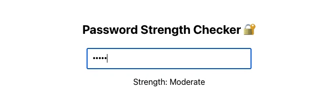

# Password Strength Checker

A simple and interactive web app that checks the strength of user-entered passwords and provides live feedback to help users create more secure passwords.

## Demo



## Features
- Real-time password strength feedback
- Checks for:
    - Minimum length
    - Uppercase and lowercase letters
    - Numbers and special characters
- Dynamic strength level: Very Weak → Very Strong
- Clean, responsive design
- Animated password strength meter bar
- Built with React

## Tech Stack
- **Frontend:** React, Javascript, CSS
- **Tooling:** Node.js, VS Code, Git
- **Version Control:** Git + GitHub

## Installation & Usage

### Prerequisites
- [Node.js](https://nodejs.org/) and npm installed
- [Git](https://git-scm.com/) installed

### Run Locally

1. Clone this repository:
```bash
git clone https://github.com/KodiKat93/password-strength-checker.git
cd password-strength-checker
```

2. Install dependencies:
```bash
npm install
```

3. Start the development server:
```bash
npm start
```

4. Open your browser and go to https://localhost:3000

## Why I Built This
This app was created by **Kodi Croonen** as part of my software development and cybersecurity learning journey. It demonstrates how client-side password validation works and encourages users to build better password habits.

## Future Improvements
- Add password generator
- Integration with HaveIBeenPwned API
- Dark mode toggle

## License
This project is licensed under the MIT License.

## Acknowledgements
Thanks to freeCodeCamp, TryHackMe, Mimo, and React Docs for learning resources.

## Author
**Kodi Croonen**
[GitHub](https://github.com/KodiKat93)